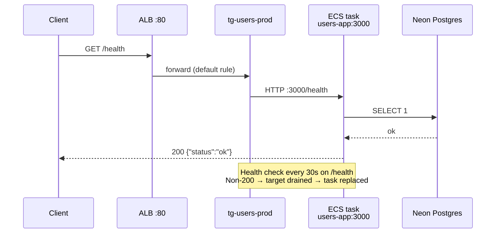
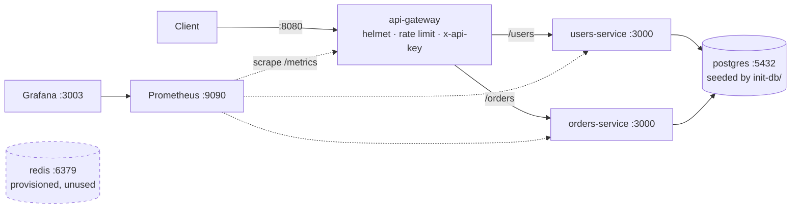
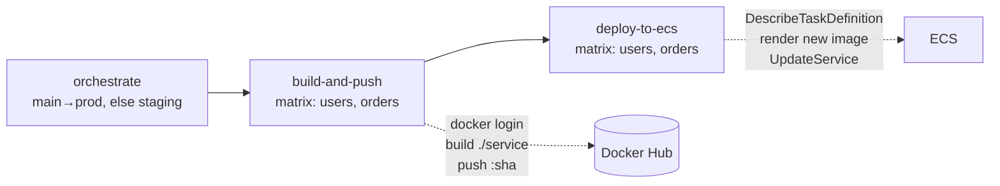

# Deployment Guide

End-to-end deployment documentation for the users/orders microservices stack:
local development, CI/CD, AWS infrastructure, and a troubleshooting runbook.

- **AWS Account:** `006291942168`
- **Region:** `eu-north-1` (Stockholm)
- **Public URL:** `http://ecs-alb-1679717735.eu-north-1.elb.amazonaws.com`

---

## 1. Architecture

### Production (AWS)

```mermaid
graph TB
    subgraph internet[" "]
        DEV[Developer]
        USER[Client]
    end

    subgraph github["GitHub"]
        REPO[amaben2020/aws-ecs-cicd<br/>branch: main]
        GHA[GitHub Actions<br/>deploy.yml]
        ENVSEC[Environment: AWS-EKS<br/>secrets]
    end

    HUB[("Docker Hub<br/>algomachine007/*")]

    subgraph aws["AWS · eu-north-1"]
        subgraph vpcA["VPC vpc-042a2397409b8db0c"]
            ALB["Application Load Balancer<br/>ecs-alb · internet-facing<br/>listener :80 → tg-users-prod<br/>listener :3000 → orders-tg-prod"]
            TGU["Target Group<br/>tg-users-prod<br/>type ip · port 3000 · HC /health"]
            TGO["Target Group<br/>orders-tg-prod<br/>type ip · port 3000 · HC /health"]

            subgraph cluster["ECS Cluster · my-ecs-cluster-prod"]
                SVCU["Service: users-service-task-service<br/>Fargate · desired 1<br/>task def users-service-task<br/>container users-app:3000"]
            end
        end

        subgraph vpcB["VPC vpc-09f7f94b5ac630d58 — MISCONFIGURED"]
            SVCO["Service: orders-service-task-service<br/>wrong VPC · no ALB attachment"]
        end
    end

    NEONU[("Neon Postgres<br/>users DB · us-east-2")]
    NEONO[("Neon Postgres<br/>orders DB · us-east-2")]

    DEV -->|git push| REPO
    REPO --> GHA
    ENVSEC -.credentials.-> GHA
    GHA -->|build + push :sha| HUB
    GHA -->|RegisterTaskDefinition<br/>UpdateService| cluster

    USER -->|HTTP :80| ALB
    ALB --> TGU
    ALB -.->|unreachable| TGO
    TGU --> SVCU
    TGO -.x SVCO

    HUB -.image pull.-> SVCU
    SVCU --> NEONU
    SVCO -.-> NEONO

    style vpcB stroke:#c33,stroke-width:2px,stroke-dasharray: 5 5
    style SVCO stroke:#c33,stroke-width:2px
    style ALB stroke:#2a7,stroke-width:2px
    style SVCU stroke:#2a7,stroke-width:2px
```

### Request path (working)



### Local development (docker-compose)



> **Note:** the `api-gateway` exists only in docker-compose. Production has no
> gateway — the ALB routes directly to services. The gateway's API-key auth and
> rate limiting are therefore **not enforced in production**.

---

## 2. AWS services used

| Service | Purpose | Identifier |
|---|---|---|
| **ECS (Fargate)** | Serverless container runtime | cluster `my-ecs-cluster-prod` |
| **Application Load Balancer** | Public HTTP entry point, health checks | `ecs-alb` |
| **EC2 Target Groups** | Routes ALB → task IPs | `tg-users-prod`, `orders-tg-prod` |
| **EC2 VPC / Subnets / SG** | Networking, ingress control | `vpc-042a2397409b8db0c`, `sg-0942bf408fc039495` |
| **IAM** | CI deploy user + task execution roles | user `amaben` |
| **CloudWatch Logs** | Container stdout/stderr | via task definition `awslogs` |

**Non-AWS:** Docker Hub (image registry), Neon (managed Postgres, us-east-2),
GitHub Actions (CI/CD).

> Registry note: images live on **Docker Hub**, not ECR. ECR was abandoned
> because the `amaben` IAM user has no ECR permissions. Task definitions
> reference `docker.io/algomachine007/<service>:<tag>`.

---

## 3. Naming conventions

These are non-obvious and caused several deployment failures. The mapping is
**not** uniform:

| Concept | Prod | Staging |
|---|---|---|
| Repo directory | `users-service/` | same |
| Docker Hub repo | `algomachine007/users-service` | same |
| Task definition family | `users-service-task` | `users-service-staging-task` |
| **Container name inside task def** | **`users-app`** | **`users-app`** |
| ECS service | `users-service-task-service` | `users-service-staging-task-service` |
| Target group | `tg-users-prod` | — |

The container name (`users-app` / `orders-app`) does **not** match the service
name. `amazon-ecs-render-task-definition` matches on container name, so
`deploy.yml` pins these explicitly in its matrix.

---

## 4. CI/CD pipeline

`.github/workflows/deploy.yml`, triggered on push to `main` or `staging`.



**Both jobs declare `environment: AWS-EKS`** — this is mandatory. All secrets are
GitHub *Environment* secrets, readable only by jobs declaring that environment.

### Required secrets (GitHub Environment `AWS-EKS`)

| Secret | Used by | Notes |
|---|---|---|
| `DOCKERHUB_USERNAME` | build-and-push | |
| `DOCKERHUB_TOKEN` | build-and-push | Must have **Read & Write** scope |
| `AWS_ACCESS_KEY_ID` | deploy-to-ecs | |
| `AWS_SECRET_ACCESS_KEY` | deploy-to-ecs | |
| `PROD_DATABASE_URL_USERS` | task definition | |
| `PROD_DATABASE_URL_ORDERS` | task definition | |
| `NEON_STAGING_DB_USERS` | task definition | |
| `NEON_STAGING_DB_ORDERS` | task definition | |

### Required IAM permissions for the CI user

```json
{
  "Version": "2012-10-17",
  "Statement": [
    {
      "Sid": "EcsTaskDefinitionManagement",
      "Effect": "Allow",
      "Action": ["ecs:DescribeTaskDefinition", "ecs:RegisterTaskDefinition"],
      "Resource": "*"
    },
    {
      "Sid": "EcsServiceRollout",
      "Effect": "Allow",
      "Action": ["ecs:DescribeServices", "ecs:UpdateService"],
      "Resource": [
        "arn:aws:ecs:eu-north-1:006291942168:service/my-ecs-cluster-prod/*",
        "arn:aws:ecs:eu-north-1:006291942168:service/my-ecs-cluster-staging/*"
      ]
    },
    {
      "Sid": "PassTaskRolesToEcs",
      "Effect": "Allow",
      "Action": "iam:PassRole",
      "Resource": "*",
      "Condition": {
        "StringEquals": { "iam:PassedToService": "ecs-tasks.amazonaws.com" }
      }
    }
  ]
}
```

`ecs:DescribeTaskDefinition` and `RegisterTaskDefinition` require `Resource: "*"` —
AWS does not support resource-level permissions on those actions.

> **Security note:** the currently-attached policy omits the `iam:PassRole`
> condition block, allowing roles to be passed to *any* service. Add the
> condition shown above.

---

## 5. Local development

```bash
cd aws-eks-cicd
docker compose up -d --build
```

| Endpoint | URL |
|---|---|
| API gateway | http://localhost:8080 |
| Grafana | http://localhost:3003 (admin/admin) |
| Prometheus | http://localhost:9090 |
| Postgres | localhost:5432 (`postgres`/`password`) |

Backend services are **not** published to host ports — the gateway is the only
entry point. All gateway routes except `/health` and `/metrics` require:

```bash
curl -H 'x-api-key: dev-local-api-key-change-me' localhost:8080/users
```

Schema is applied automatically from `init-db/init.sql` via the Postgres
image's `docker-entrypoint-initdb.d` hook — **first run only**, on an empty
volume. To re-seed: `docker compose down -v && docker compose up -d`.

### Observability

Each service exposes `/metrics` (prom-client):

- `http_requests_total`, `http_request_duration_seconds` — RED metrics, labeled `method`/`route`/`status_code`
- `pg_pool_total_count`, `pg_pool_idle_count`, `pg_pool_waiting_count` — connection pool saturation
- Node defaults — event-loop lag, memory, CPU, GC

Grafana auto-provisions the Prometheus datasource and an **App Overview**
dashboard from `grafana/provisioning/` and `grafana/dashboards/`.

> `rate()` queries need ~2 scrape intervals of traffic before panels leave zero.

---

## 6. First-time production deployment

1. **Create ECR-free image repos** — Docker Hub repos `algomachine007/users-service`
   and `algomachine007/orders-service`, set to public (ECS then needs no
   `repositoryCredentials`).
2. **Create the GitHub Environment** named `AWS-EKS` and populate all secrets above.
3. **Apply the database schema** to each Neon database (see §7).
4. **Create ECS services** in `vpc-042a2397409b8db0c` with an ALB attachment
   (see §8 — the LB attachment must be part of service creation or added via
   `update-service`; without it, tasks never register as targets).
5. **Open the ALB security group** on port 80 to `0.0.0.0/0`.
6. **Push to `main`** to trigger the pipeline.

---

## 7. Database schema

Each service owns a **separate** Neon database, so the schema is split. Postgres
cannot enforce a foreign key across databases, which is why `schema/orders.sql`
declares `user_id` without a FK to `users(id)` — referential integrity between
the two is the application's responsibility.

| File | Applies to | Contents |
|---|---|---|
| `schema/users.sql` | users DB (prod + staging) | `users` table |
| `schema/orders.sql` | orders DB (prod + staging) | `orders` table, no FK, index on `user_id` |
| `init-db/init.sql` | **local docker-compose only** | both tables in one DB, FK intact |

```bash
psql "<USERS_DB_URL>"  -v ON_ERROR_STOP=1 -f schema/users.sql
psql "<ORDERS_DB_URL>" -v ON_ERROR_STOP=1 -f schema/orders.sql

# verify
psql "<USERS_DB_URL>" -c "\dt"
```

Both files are idempotent (`CREATE TABLE IF NOT EXISTS`), so re-running is safe.

**Status:** applied to both prod databases — `users` and `orders` tables exist,
and `GET`/`POST /users` verified working through the ALB. **Not yet applied to
the two staging databases** (the staging credentials on hand failed
authentication — they appear to reuse the prod passwords).

---

## 8. ⚠️ OUTSTANDING: orders-service is in the wrong VPC

| | VPC |
|---|---|
| ALB `ecs-alb` | `vpc-042a2397409b8db0c` |
| users-service | `vpc-042a2397409b8db0c` ✅ |
| orders-service | `vpc-09f7f94b5ac630d58` ❌ |

An ALB can only route to targets in its own VPC, and **an ALB's VPC cannot be
changed after creation**. The console greys out `ecs-alb` for this service with
"Load balancer is not in the selected VPC."

The service must be recreated. Its VPC is fixed at creation.

```bash
# 1. Delete the misplaced service (it serves no traffic today)
aws ecs delete-service --cluster my-ecs-cluster-prod \
  --service orders-service-task-service --force --region eu-north-1

# 2. Recreate in the ALB's VPC, mirroring users-service networking
aws ecs create-service \
  --cluster my-ecs-cluster-prod \
  --service-name orders-service-task-service \
  --task-definition orders-service-task \
  --desired-count 1 \
  --capacity-provider-strategy capacityProvider=FARGATE,weight=1 \
  --network-configuration 'awsvpcConfiguration={subnets=[subnet-0b724c12a9aac35e3,subnet-0a89853e6049b3ebc,subnet-06832428e014ca4a0],securityGroups=[sg-0942bf408fc039495],assignPublicIp=ENABLED}' \
  --load-balancers targetGroupArn=arn:aws:elasticloadbalancing:eu-north-1:006291942168:targetgroup/orders-tg-prod/1bbd5c1a3c23566c,containerName=orders-app,containerPort=3000 \
  --deployment-configuration 'deploymentCircuitBreaker={enable=true,rollback=true},maximumPercent=200,minimumHealthyPercent=100' \
  --region eu-north-1
```

Requires `ecs:CreateService` and `ecs:DeleteService`, neither currently granted.

### Then: routing for orders

The ALB currently reaches orders via a **port 3000 listener**, which is not
publicly open — and opening it would be unsafe, because tasks share
`sg-0942bf408fc039495` and run with `assignPublicIp=ENABLED`, so port 3000 to
`0.0.0.0/0` would expose containers directly, bypassing the ALB.

Prefer a path-based rule on the existing port-80 listener:

```bash
aws elbv2 create-rule \
  --listener-arn arn:aws:elasticloadbalancing:eu-north-1:006291942168:listener/app/ecs-alb/04696877fb2f96fa/2ac645334d7ee1a3 \
  --priority 10 \
  --conditions Field=path-pattern,Values='/orders*' \
  --actions Type=forward,TargetGroupArn=arn:aws:elasticloadbalancing:eu-north-1:006291942168:targetgroup/orders-tg-prod/1bbd5c1a3c23566c \
  --region eu-north-1
```

Then delete the port-3000 listener.

---

## 9. Troubleshooting runbook

Every failure below was hit during this deployment.

| Symptom | Cause | Fix |
|---|---|---|
| `curl` to ALB times out (TCP, no HTTP) | Security group has no public ingress | Add inbound TCP 80 from `0.0.0.0/0` to the ALB SG |
| ALB returns 503 | Target group has zero registered targets | Service missing `loadBalancers` config — attach via `update-service` |
| Target `unhealthy`, `Target.ResponseCodeMismatch [404]` | Health check path `/` but service only serves `/health` | Set target group health check path to `/health` |
| Target `unhealthy` with `[503]` | `/health` reached but DB unreachable | Check `DATABASE_URL`, Neon availability |
| Tasks start then stop repeatedly | Failing ALB health checks → deregistered → replaced | Fix health check before assuming app is broken |
| `failed to normalize image reference "https://hub.docker.com/r/..."` | Browser URL pasted into task def image field | Use `docker.io/<ns>/<repo>:<tag>` |
| GHA: `Could not load credentials from any providers` | Secrets are Environment secrets; job lacks `environment:` | Add `environment: AWS-EKS` to the job |
| GHA: `unauthorized: access token has insufficient scopes` | Docker Hub token is read-only | Regenerate with Read & Write |
| GHA: `Could not find container definition with matching name` | `container-name` ≠ actual container name | Use `users-app` / `orders-app` |
| GHA: `AccessDeniedException ... ecs:DescribeTaskDefinition` | CI user lacks ECS permissions | Attach the policy in §4 |
| GHA changes don't take effect | Re-running an old run replays that commit's workflow file | Trigger a fresh run from current HEAD |
| Console: "Load balancer is not in the selected VPC" | Service and ALB in different VPCs | Recreate the service (§8) |

### Useful commands

```bash
# Service state + rollout
aws ecs describe-services --cluster my-ecs-cluster-prod \
  --services users-service-task-service --region eu-north-1 \
  --query 'services[0].{running:runningCount,desired:desiredCount,lb:loadBalancers,deploy:deployments[0].rolloutState}'

# Why tasks are dying (most useful single command)
aws ecs describe-services --cluster my-ecs-cluster-prod \
  --services users-service-task-service --region eu-north-1 \
  --query 'services[0].events[0:10].[createdAt,message]' --output text

# Target health
aws elbv2 describe-target-health --region eu-north-1 \
  --target-group-arn arn:aws:elasticloadbalancing:eu-north-1:006291942168:targetgroup/tg-users-prod/124b7de31717b89e \
  --query 'TargetHealthDescriptions[].{id:Target.Id,state:TargetHealth.State,desc:TargetHealth.Description}'

# Smoke test
curl -s -w '\n%{http_code}\n' http://ecs-alb-1679717735.eu-north-1.elb.amazonaws.com/health
```

---

## 10. Known gaps

| Gap | Impact |
|---|---|
| Staging DB schema not applied (§7) | staging deploys will 500 on table access |
| orders-service in wrong VPC (§8) | orders unreachable via ALB |
| No auth in production | `api-gateway` (helmet, rate limit, API key) is docker-compose only; ALB routes straight to services |
| `REDIS_URL` set but unused | Dead config in compose and task definitions |
| No HTTPS | ALB is HTTP-only; no ACM certificate or :443 listener |
| Tasks have public IPs | `assignPublicIp=ENABLED` in public subnets; private subnets + NAT would be safer |
| Tasks share the ALB security group | Same SG for LB and tasks removes a layer of isolation |
| No Prometheus/Grafana in prod | `/metrics` is exposed but nothing scrapes it |
| Single environment for prod + staging secrets | `AWS-EKS` holds both `PROD_*` and `NEON_STAGING_*` |
| `deploy.yml` deploys both services on every push | No path filtering; unchanged services redeploy |
