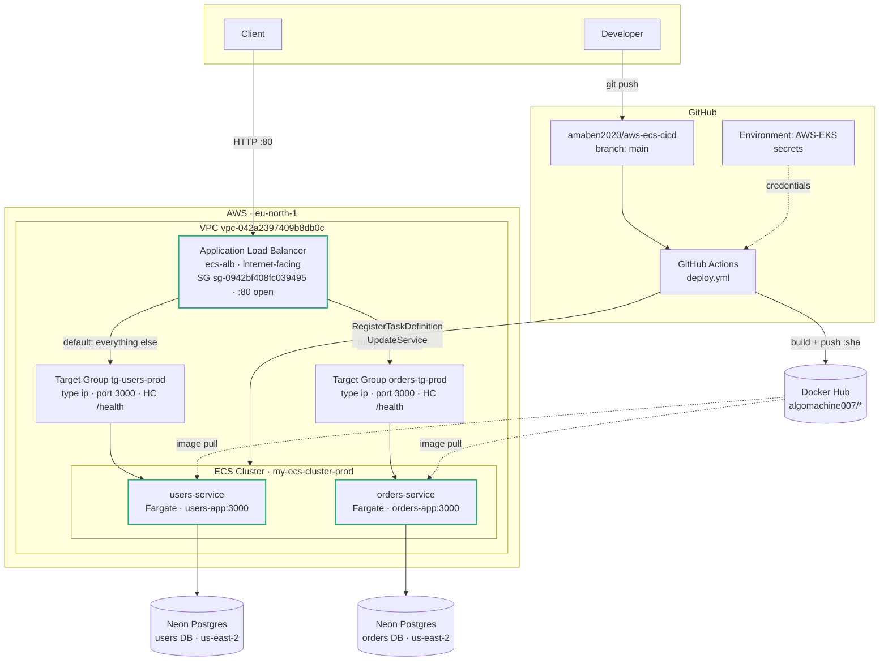
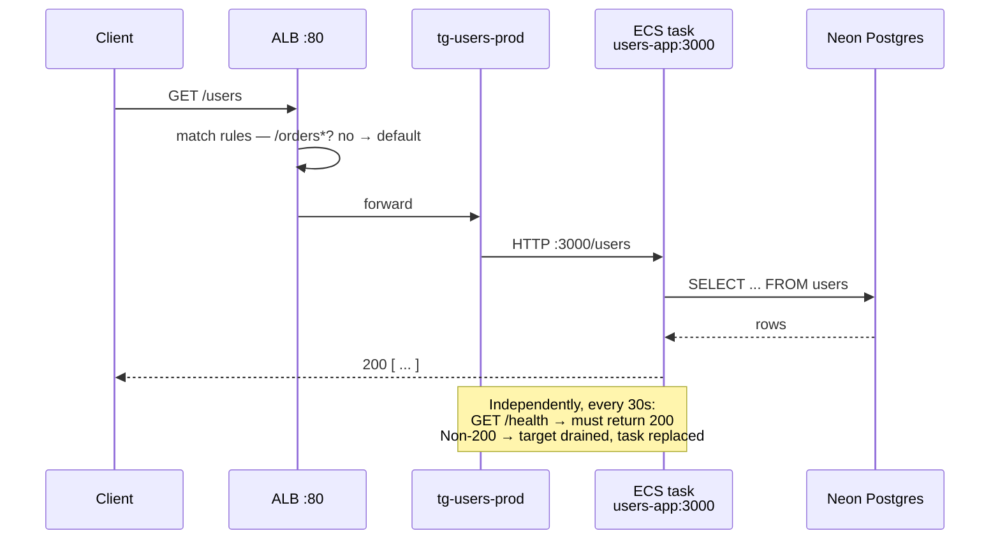
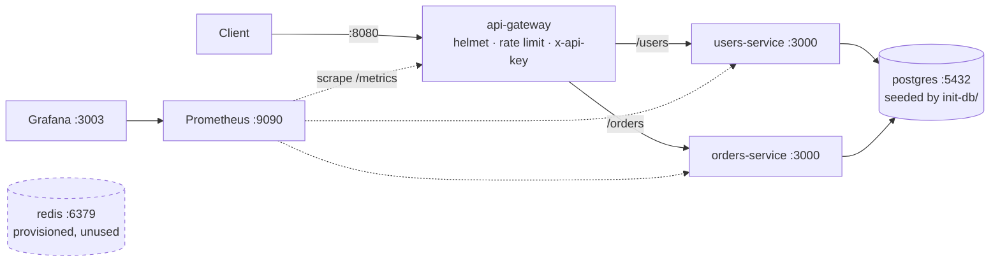
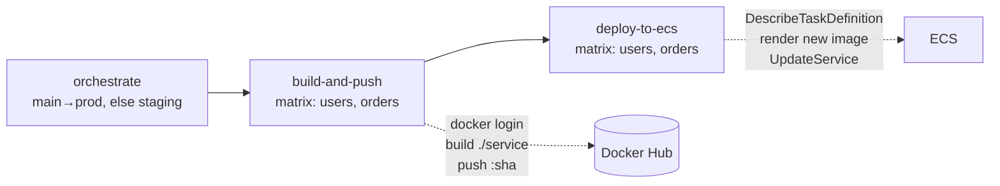

# Deployment Guide

A step-by-step guide to running this two-service stack locally and deploying it
to AWS ECS Fargate behind an Application Load Balancer, with GitHub Actions CI/CD.

Follow the parts in order — each one builds on the last, and every step ends with
a command that proves it worked.

| | |
|---|---|
| **AWS Account** | `006291942168` |
| **Region** | `eu-north-1` (Stockholm) |
| **Live URL** | `http://ecs-alb-1679717735.eu-north-1.elb.amazonaws.com` |
| **Repo** | `amaben2020/aws-ecs-cicd`, deploys from `main` |

---

## What you're building

Two independent Node/Express services (`users-service`, `orders-service`), each
with its own Postgres database, running as Fargate tasks behind one public ALB
that routes by URL path.



### How one request flows



### Services and tools used

| Service | Role |
|---|---|
| **ECS (Fargate)** | Runs containers without managing servers |
| **Application Load Balancer** | Public entry point; path routing; health checks |
| **Target Groups** | Registers task IPs as backends (`type: ip` for Fargate) |
| **VPC / Subnets / Security Groups** | Network placement and ingress control |
| **IAM** | Permissions for the CI user and the ECS task execution role |
| **Docker Hub** | Image registry (not ECR — see note below) |
| **Neon** | Managed Postgres, one database per service |
| **GitHub Actions** | Builds images, registers task definitions, rolls out |

> **Why Docker Hub, not ECR?** The IAM user available for this project has no ECR
> permissions. Docker Hub repos are public, so ECS pulls them without needing
> `repositoryCredentials`. Everything else is identical — swap the registry host
> in the task definition and the CI login step if you move to ECR.

---

## Part 1 — Run it locally

The fastest way to see the stack working. Needs Docker only.

```bash
cd aws-eks-cicd
docker compose up -d --build
```

This starts an api-gateway, both services, Postgres, Redis, Prometheus and Grafana:



**Verify:**

```bash
curl localhost:8080/health
# {"status":"ok"}

curl -H 'x-api-key: dev-local-api-key-change-me' localhost:8080/users
# []

curl -X POST -H 'x-api-key: dev-local-api-key-change-me' \
     -H 'Content-Type: application/json' \
     -d '{"username":"alice","email":"alice@example.com"}' \
     localhost:8080/users
# {"id":1,"username":"alice",...}
```

| What | Where |
|---|---|
| API gateway | http://localhost:8080 |
| Grafana | http://localhost:3003 — `admin` / `admin` |
| Prometheus | http://localhost:9090 |
| Postgres | `localhost:5432` — `postgres` / `password` |

The backend services deliberately have **no host ports** — the gateway is the
only way in. Every route except `/health` and `/metrics` needs the `x-api-key`
header.

The schema is applied automatically from `init-db/init.sql` by the Postgres
image, but **only on first run against an empty volume**. To re-seed:

```bash
docker compose down -v && docker compose up -d
```

### Observability

Each service exposes `/metrics` for Prometheus:

- `http_requests_total`, `http_request_duration_seconds` — RED metrics labeled `method` / `route` / `status_code`
- `pg_pool_total_count`, `pg_pool_idle_count`, `pg_pool_waiting_count` — connection pool saturation
- Node.js defaults — event-loop lag, memory, CPU, GC

Grafana auto-provisions the datasource and an **App Overview** dashboard from
`grafana/provisioning/` and `grafana/dashboards/` — no manual setup. Panels use
`rate()`, so generate some traffic and wait ~30s before they leave zero:

```bash
for i in {1..20}; do curl -s -H 'x-api-key: dev-local-api-key-change-me' localhost:8080/users >/dev/null; done
```

> ⚠️ **The api-gateway is local-only.** Production has no gateway — the ALB
> routes straight to services, so helmet, rate limiting and API-key auth are
> **not enforced in production**. See [Known gaps](#known-gaps).

---

## Part 2 — Naming conventions (read before deploying)

These names are *not* uniform, and mismatches caused most of the failures in the
runbook. Using `users-service` as the example:

| Concept | Value | Notes |
|---|---|---|
| Repo directory | `users-service/` | Docker build context |
| Docker Hub repo | `algomachine007/users-service` | no env suffix |
| Task definition family | `users-service-task` | staging: `users-service-staging-task` |
| **Container name in task def** | **`users-app`** | ⚠️ **not** `users-service` |
| ECS service | `users-service-task-service` | family + `-service` |
| Target group | `tg-users-prod` | note: orders uses `orders-tg-prod` — different word order |

The container name trips people up: `amazon-ecs-render-task-definition` matches
on it, so `deploy.yml` pins `users-app` / `orders-app` explicitly in its matrix
rather than deriving them.

---

## Part 3 — Deploy to production

Steps are in dependency order. Anything created earlier is a prerequisite for
what follows.

### 3.1 — Push the images

```bash
docker login

docker build -t algomachine007/users-service:latest ./users-service
docker push algomachine007/users-service:latest

docker build -t algomachine007/orders-service:latest ./orders-service
docker push algomachine007/orders-service:latest
```

Make both repos **public** on Docker Hub (Settings → Make public) so ECS can pull
without credentials.

**Verify:** https://hub.docker.com/r/algomachine007/users-service shows a `latest`
tag. (The "No overview available" message refers to the README, not the image —
check the **Tag summary** panel on the right.)

### 3.2 — Create the databases and apply the schema

Each service owns a **separate** Neon database. Because of that, the combined
`init-db/init.sql` cannot be used as-is: its `orders → users` foreign key is
unenforceable across two databases.

| File | Apply to | Contents |
|---|---|---|
| `schema/users.sql` | users DB | `users` table |
| `schema/orders.sql` | orders DB | `orders` table, **no FK**, index on `user_id` |
| `init-db/init.sql` | local compose only | both tables, one DB, FK intact |

```bash
psql "<USERS_DB_URL>"  -v ON_ERROR_STOP=1 -f schema/users.sql
psql "<ORDERS_DB_URL>" -v ON_ERROR_STOP=1 -f schema/orders.sql
```

Both are idempotent (`CREATE TABLE IF NOT EXISTS`), so re-running is safe.

**Verify:**

```bash
psql "<USERS_DB_URL>" -c "\dt"
#  public | users | table | neondb_owner
```

### 3.3 — Networking

Everything must live in **one VPC** — `vpc-042a2397409b8db0c`.

| Resource | Value |
|---|---|
| VPC | `vpc-042a2397409b8db0c` |
| Subnets | `subnet-0a89853e6049b3ebc`, `subnet-0b724c12a9aac35e3`, `subnet-06832428e014ca4a0` |
| Security group | `sg-0942bf408fc039495` |

> ⚠️ **The single most important constraint in this guide:** an ALB can only
> route to targets **in its own VPC**, and neither an ALB's VPC nor a service's
> VPC can be changed after creation. Put a service in the wrong VPC and the
> console greys the load balancer out — *"Load balancer is not in the selected
> VPC"* — and the only fix is to delete and recreate the service.

### 3.4 — Target groups

One per service. **Target type must be `ip`** (Fargate has no instances to
register).

| Setting | `tg-users-prod` | `orders-tg-prod` |
|---|---|---|
| Target type | `ip` | `ip` |
| Protocol : Port | HTTP : 3000 | HTTP : 3000 |
| VPC | `vpc-042a2397409b8db0c` | same |
| **Health check path** | **`/health`** | **`/health`** |
| Success codes | 200 | 200 |

> The health check path defaults to `/`, which these services don't implement —
> leave it and every task will be killed in a loop with
> `Target.ResponseCodeMismatch [404]`.

### 3.5 — Load balancer and routing

Create an internet-facing ALB named `ecs-alb` in `vpc-042a2397409b8db0c`, using
security group `sg-0942bf408fc039495`, with an **HTTP :80** listener.

Then add a path rule so one listener serves both services:

| Priority | Condition | Forward to |
|---|---|---|
| 10 | path `/orders*` | `orders-tg-prod` |
| default | everything else | `tg-users-prod` |

Console: EC2 → Load balancers → `ecs-alb` → **Listeners and rules** → click
**HTTP:80** → **Add rule** → condition **Path** = `/orders*` → *(click Confirm —
the condition isn't saved until you do)* → action **Forward** → `orders-tg-prod`
→ priority `10`.

Or by CLI:

```bash
aws elbv2 create-rule \
  --listener-arn arn:aws:elasticloadbalancing:eu-north-1:006291942168:listener/app/ecs-alb/04696877fb2f96fa/2ac645334d7ee1a3 \
  --priority 10 \
  --conditions Field=path-pattern,Values='/orders*' \
  --actions Type=forward,TargetGroupArn=arn:aws:elasticloadbalancing:eu-north-1:006291942168:targetgroup/orders-tg-prod/1bbd5c1a3c23566c \
  --region eu-north-1
```

**Verify:**

```bash
aws elbv2 describe-rules --region eu-north-1 \
  --listener-arn arn:aws:elasticloadbalancing:eu-north-1:006291942168:listener/app/ecs-alb/04696877fb2f96fa/2ac645334d7ee1a3 \
  --query 'Rules[].{priority:Priority,paths:Conditions[].Values,tg:Actions[0].TargetGroupArn}'
```

### 3.6 — Task definitions

One family per service, Fargate, `awsvpc` networking.

| Setting | users | orders |
|---|---|---|
| Family | `users-service-task` | `orders-service-task` |
| **Container name** | **`users-app`** | **`orders-app`** |
| Image | `docker.io/algomachine007/users-service:latest` | `docker.io/algomachine007/orders-service:latest` |
| Port mapping | 3000/tcp | 3000/tcp |
| Env: `PORT` | `3000` | `3000` |
| Env: `NODE_ENV` | `production` | `production` |
| Env: `DATABASE_URL` | users DB URL | orders DB URL |

> The image field takes a **pullable reference**, not a browser URL. Pasting
> `https://hub.docker.com/r/...` produces
> `failed to normalize image reference`.

### 3.7 — ECS services

Create the cluster `my-ecs-cluster-prod`, then one service per task definition:

| Setting | Value |
|---|---|
| Launch type | FARGATE |
| Service name | `users-service-task-service` / `orders-service-task-service` |
| Desired tasks | 1 |
| VPC / subnets / SG | from 3.3 |
| Public IP | On |
| **Load balancing** | **Attach here — see warning** |
| Container to load balance | `users-app 3000:3000` / `orders-app 3000:3000` |
| Target group | `tg-users-prod` / `orders-tg-prod` |

> ⚠️ **Attach the load balancer as part of service creation.** A service with no
> `loadBalancers` config never registers its tasks as targets — the target group
> stays permanently empty and the ALB returns 503, no matter how healthy the
> tasks are. If you missed it, fix without recreating:
>
> ```bash
> aws ecs update-service --cluster my-ecs-cluster-prod \
>   --service users-service-task-service \
>   --load-balancers targetGroupArn=<TG_ARN>,containerName=users-app,containerPort=3000 \
>   --region eu-north-1
> ```

**Verify** — the target should go `healthy` within ~60s:

```bash
aws elbv2 describe-target-health --region eu-north-1 \
  --target-group-arn arn:aws:elasticloadbalancing:eu-north-1:006291942168:targetgroup/tg-users-prod/124b7de31717b89e \
  --query 'TargetHealthDescriptions[].{id:Target.Id,state:TargetHealth.State,desc:TargetHealth.Description}'
```

### 3.8 — Open the security group

Nothing reaches the ALB until its security group allows inbound traffic. The
default VPC security group only allows traffic from itself, which presents as a
**TCP connection timeout** — not an HTTP error.

```bash
aws ec2 authorize-security-group-ingress \
  --group-id sg-0942bf408fc039495 \
  --protocol tcp --port 80 --cidr 0.0.0.0/0 \
  --region eu-north-1
```

> **Open port 80 only.** The tasks share this security group and run with
> `assignPublicIp=ENABLED`, so opening port 3000 to `0.0.0.0/0` would expose the
> containers directly to the internet, bypassing the ALB entirely.

### 3.9 — Verify the whole thing

```bash
ALB=http://ecs-alb-1679717735.eu-north-1.elb.amazonaws.com

curl $ALB/health     # 200 {"status":"ok"}
curl $ALB/users      # 200 [...]
curl $ALB/orders     # 200 [...]
curl $ALB/orders/1   # 200 {...}

curl -X POST $ALB/users -H 'Content-Type: application/json' \
  -d '{"username":"amara","email":"amara@prod.example.com"}'    # 201

curl -X POST $ALB/orders -H 'Content-Type: application/json' \
  -d '{"user_id":1,"item":"widget","quantity":3}'               # 201
```

---

## Part 4 — Wire up CI/CD

`.github/workflows/deploy.yml` runs on push to `main` (→ prod) or `staging` (→ staging).



### 4.1 — Create the GitHub Environment

Settings → Environments → **New environment** → name it **`AWS-EKS`**.

> ⚠️ Both jobs declare `environment: AWS-EKS`. These are **Environment** secrets,
> not repository secrets — a job that doesn't declare the environment sees empty
> strings and fails with *"Could not load credentials from any providers"*. The
> environment name in `deploy.yml` must match this exactly.

### 4.2 — Add the secrets

| Secret | Used by | Notes |
|---|---|---|
| `DOCKERHUB_USERNAME` | build-and-push | |
| `DOCKERHUB_TOKEN` | build-and-push | ⚠️ needs **Read & Write** scope — a read-only token fails with `insufficient scopes` |
| `AWS_ACCESS_KEY_ID` | deploy-to-ecs | |
| `AWS_SECRET_ACCESS_KEY` | deploy-to-ecs | |
| `PROD_DATABASE_URL_USERS` | task definition | |
| `PROD_DATABASE_URL_ORDERS` | task definition | |
| `NEON_STAGING_DB_USERS` | task definition | |
| `NEON_STAGING_DB_ORDERS` | task definition | |

### 4.3 — IAM policy for the CI user

```json
{
  "Version": "2012-10-17",
  "Statement": [
    {
      "Sid": "EcsTaskDefinitionManagement",
      "Effect": "Allow",
      "Action": ["ecs:DescribeTaskDefinition", "ecs:RegisterTaskDefinition"],
      "Resource": "*"
    },
    {
      "Sid": "EcsServiceRollout",
      "Effect": "Allow",
      "Action": ["ecs:DescribeServices", "ecs:UpdateService"],
      "Resource": [
        "arn:aws:ecs:eu-north-1:006291942168:service/my-ecs-cluster-prod/*",
        "arn:aws:ecs:eu-north-1:006291942168:service/my-ecs-cluster-staging/*"
      ]
    },
    {
      "Sid": "PassTaskRolesToEcs",
      "Effect": "Allow",
      "Action": "iam:PassRole",
      "Resource": "*",
      "Condition": {
        "StringEquals": { "iam:PassedToService": "ecs-tasks.amazonaws.com" }
      }
    }
  ]
}
```

The first two actions require `Resource: "*"` — AWS doesn't support
resource-level permissions on them. `iam:PassRole` is the one people forget:
registering a task definition means handing ECS the task execution role, and
without it you'll fail *after* `DescribeTaskDefinition` succeeds.

> **Security note:** the currently-attached policy is missing the `iam:PassRole`
> condition block, so it can pass roles to any service. Add the condition above.

### 4.4 — Deploy

```bash
git push origin main
```

**Verify:** Actions tab → the run should be green through `Build & Push` and
`Rollout` for both services.

> If a change to `deploy.yml` seems not to apply, check you aren't clicking
> **Re-run** on an old run — re-runs replay the workflow file from *that run's*
> commit. Push a new commit or use **Run workflow** on `main`.

---

## Part 5 — Staging

**Staging does not currently work.** Only the task definitions exist.

| Component | Status |
|---|---|
| `staging` branch | ❌ doesn't exist (repo has `main` and `master`) |
| Cluster `my-ecs-cluster-staging` | ❌ doesn't exist |
| Staging services | ❌ can't exist without the cluster |
| Staging target groups | ❌ none |
| Staging ALB / listener rules | ❌ none |
| Task definitions | ✅ `users-service-staging-task`, `orders-service-staging-task` |
| Staging DB schema | ❌ not applied |

### How the branch mapping works

`deploy.yml`'s `orchestrate` job sets `aws_env` from the branch:

| Branch | `aws_env` | Task family | ECS service | Cluster |
|---|---|---|---|---|
| `main` | `prod` | `users-service-task` | `users-service-task-service` | `my-ecs-cluster-prod` |
| anything else (workflow only triggers on `staging`) | `staging` | `users-service-staging-task` | `users-service-staging-task-service` | `my-ecs-cluster-staging` |

So the branch must be named exactly **`staging`** — the workflow's `on.push.branches`
only listens for `main` and `staging`.

### To make staging work

1. **Apply the schema** to both staging databases (Part 3.2) using the *staging*
   Neon credentials — each Neon endpoint has its own password; reusing the prod
   password fails with `password authentication failed`.
2. **Create cluster** `my-ecs-cluster-staging`.
3. **Create target groups** — e.g. `tg-users-staging`, `orders-tg-staging`
   (type `ip`, port 3000, health check `/health`), in the same VPC as whichever
   ALB will serve staging.
4. **Create an ALB** for staging, or reuse `ecs-alb` with host/path rules. A
   separate ALB is cleaner but costs more.
5. **Create the services** named `users-service-staging-task-service` and
   `orders-service-staging-task-service`, each with its load balancer attached.
6. **Create the branch** and push:
   ```bash
   git checkout -b staging && git push -u origin staging
   ```

Everything else — the workflow, task definitions and naming — is already in place.

---

## Monitoring, dashboards and logs — where to look

| What | Local (docker compose) | Production |
|---|---|---|
| **Grafana** | http://localhost:3003 — `admin` / `admin` | ❌ not deployed |
| **Prometheus** | http://localhost:9090 | ❌ not deployed |
| **Prometheus targets** | http://localhost:9090/targets | ❌ |
| **App Overview dashboard** | http://localhost:3003/d/app-overview | ❌ |
| **Raw metrics** | http://localhost:8080/metrics | `<ALB>/metrics` — served, but nothing scrapes it |
| **Container logs** | `docker compose logs -f users-service` | ❌ **none captured** — see below |
| **Task lifecycle events** | — | `aws ecs describe-services ... --query 'services[0].events'` |

> ⚠️ **There are no production logs.** Both task definitions have
> `logConfiguration: null`, so container stdout/stderr is discarded — there is no
> CloudWatch log group to open. ECS **service events** are currently the only
> visibility into why a task started or stopped. See
> [lifecycle.md](lifecycle.md#observing-it) for the `awslogs` block to add.

> ⚠️ **Prometheus and Grafana are docker-compose only.** In production the
> services still expose `/metrics`, but nothing collects it. To close this, run
> Prometheus somewhere it can reach the tasks (ECS service, AMP, or Grafana
> Cloud) and point it at the ALB or the task IPs. The provisioned dashboard JSON
> in `grafana/dashboards/` is reusable as-is — its queries group by `job`.

---

## Troubleshooting runbook

Every failure below was hit while building this.

| Symptom | Cause | Fix |
|---|---|---|
| `curl` to ALB times out (no HTTP response at all) | Security group has no public ingress | Add inbound TCP 80 from `0.0.0.0/0` (3.8) |
| ALB returns **503** | Target group has zero registered targets | Service is missing `loadBalancers` — attach it (3.7) |
| Target `unhealthy`, `Target.ResponseCodeMismatch [404]` | Health check path is `/`, service only serves `/health` | Set health check path to `/health` (3.4) |
| Target `unhealthy` with `[503]` | `/health` reached but its DB check failed | Check `DATABASE_URL` and Neon availability |
| Tasks start, then stop, repeatedly | Failing health checks → deregistered → replaced | Fix the health check before assuming the app is broken |
| `Cannot GET /orders` (Express 404 via ALB) | Path rule missing, so it fell through to the default target group | Add the `/orders*` rule (3.5) |
| `failed to normalize image reference "https://hub.docker.com/r/..."` | Browser URL pasted into the image field | Use `docker.io/<ns>/<repo>:<tag>` |
| Console: *"Load balancer is not in the selected VPC"* | Service and ALB are in different VPCs | Delete and recreate the service in the ALB's VPC (3.3) |
| GHA: `Could not load credentials from any providers` | Secrets are Environment secrets; the job doesn't declare the environment | Add `environment: AWS-EKS` to the job (4.1) |
| GHA: `unauthorized: access token has insufficient scopes` | Docker Hub token is read-only | Regenerate with Read & Write |
| GHA: `Could not find container definition with matching name` | `container-name` ≠ the name inside the task definition | Use `users-app` / `orders-app` (Part 2) |
| GHA: `AccessDeniedException ... ecs:DescribeTaskDefinition` | CI user lacks ECS permissions | Attach the policy in 4.3 |
| GHA changes appear to do nothing | Re-running an old run replays that commit's workflow | Push a new commit, or **Run workflow** on `main` |

### Diagnostic commands

```bash
# Service state and rollout status
aws ecs describe-services --cluster my-ecs-cluster-prod \
  --services users-service-task-service --region eu-north-1 \
  --query 'services[0].{running:runningCount,desired:desiredCount,lb:loadBalancers,deploy:deployments[0].rolloutState}'

# Why tasks are dying — the single most useful command here
aws ecs describe-services --cluster my-ecs-cluster-prod \
  --services users-service-task-service --region eu-north-1 \
  --query 'services[0].events[0:10].[createdAt,message]' --output text

# Target health, with the failure reason
aws elbv2 describe-target-health --region eu-north-1 \
  --target-group-arn arn:aws:elasticloadbalancing:eu-north-1:006291942168:targetgroup/tg-users-prod/124b7de31717b89e \
  --query 'TargetHealthDescriptions[].{id:Target.Id,state:TargetHealth.State,desc:TargetHealth.Description}'

# Confirm a service is in the expected VPC
aws ecs describe-services --cluster my-ecs-cluster-prod \
  --services users-service-task-service --region eu-north-1 \
  --query 'services[0].networkConfiguration.awsvpcConfiguration'
```

---

## Known gaps

| Gap | Impact |
|---|---|
| Staging environment doesn't exist (Part 5) | Can only deploy to prod |
| **No logging on either task definition** | `logConfiguration` is null — container output is discarded; you cannot debug a crashing task ([lifecycle.md](lifecycle.md#observing-it)) |
| **Neither service handles `SIGTERM`** | In-flight requests are cut on every deploy; pg pool never closed ([lifecycle.md](lifecycle.md#what-actually-happens-here)) |
| No auth in production | The api-gateway (helmet, rate limit, API key) is docker-compose only; the ALB routes straight to services |
| No HTTPS | ALB is HTTP-only — no ACM certificate, no `:443` listener |
| Tasks have public IPs | `assignPublicIp=ENABLED` in public subnets; private subnets + NAT would be safer |
| Tasks share the ALB's security group | Removes a layer of isolation between load balancer and workloads |
| Redundant `:3000` ALB listener | Harmless while the port stays closed; delete it |
| `REDIS_URL` set but unused | Dead config in compose and task definitions |
| No metrics scraping in prod | `/metrics` is exposed but nothing collects it |
| One GitHub Environment for prod and staging | `AWS-EKS` holds both `PROD_*` and `NEON_STAGING_*` secrets |
| Every push redeploys both services | No path filtering in the workflow |
| No FK between orders and users | Separate databases make it unenforceable; integrity is the app's responsibility |
