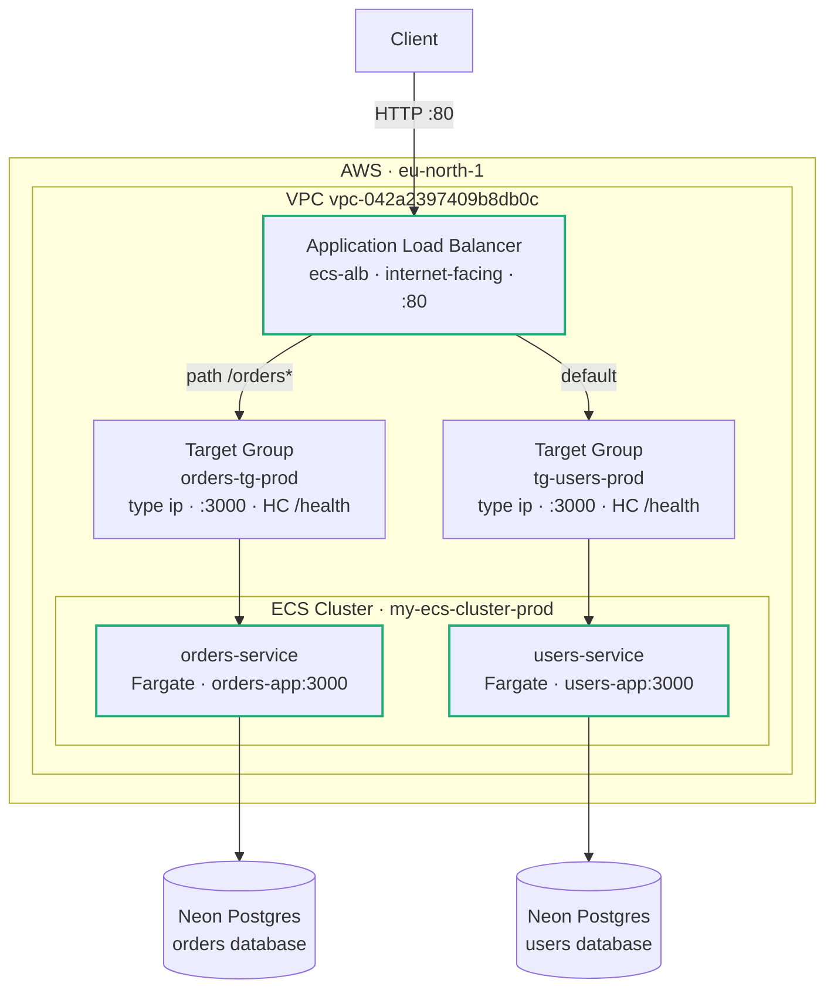
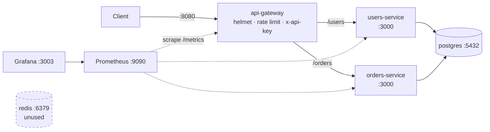
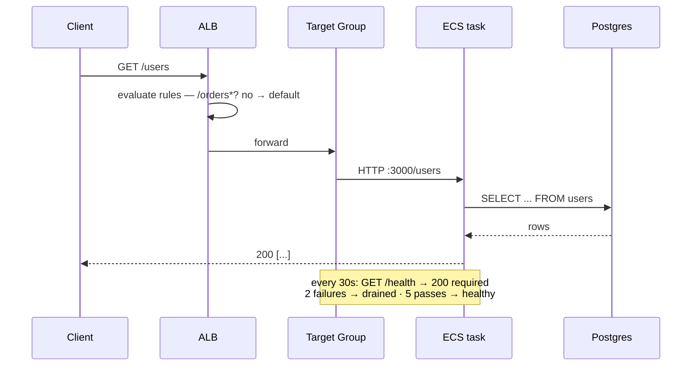
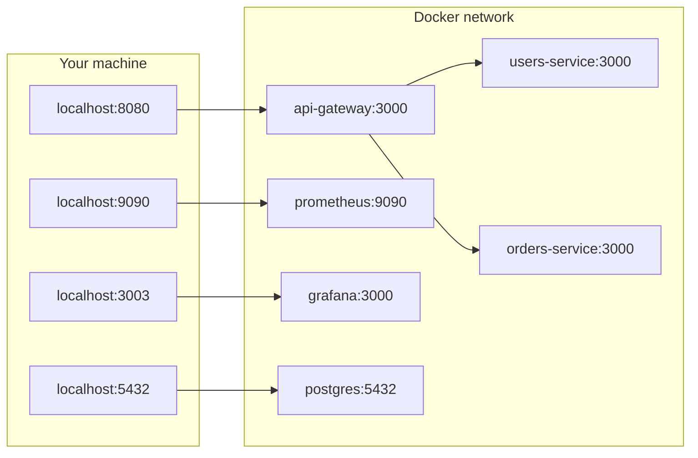
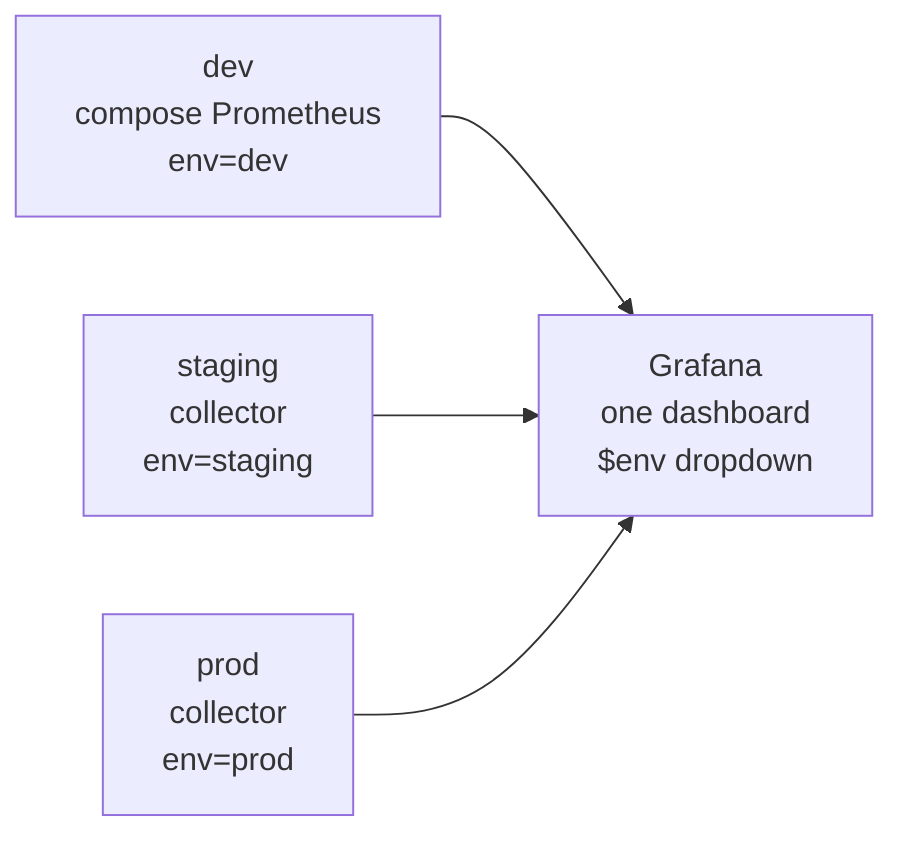
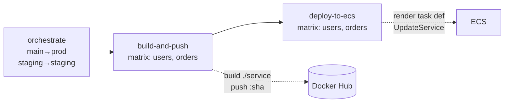

# Microservices on AWS ECS Fargate

Two independent Node.js services, each owning its own Postgres database, deployed
to **AWS ECS Fargate** behind an **Application Load Balancer**, shipped by
**GitHub Actions**, and instrumented with **Prometheus** metrics rendered in
**Grafana**.

```
Live:  http://ecs-alb-1679717735.eu-north-1.elb.amazonaws.com
       GET /health   GET /users   GET /orders
```

| | |
|---|---|
| **Runtime** | AWS ECS Fargate · `eu-north-1` |
| **Ingress** | Application Load Balancer, path-based routing |
| **Registry** | Docker Hub |
| **Database** | Neon Postgres — one database per service |
| **CI/CD** | GitHub Actions → Docker Hub → ECS rolling deploy |
| **Observability** | prom-client → Prometheus → Grafana |
| **Local** | Docker Compose — full stack incl. gateway, Prometheus, Grafana |

---

## Contents

- [Architecture](#architecture)
- [The services](#the-services)
- [Ports](#ports)
- [Observability](#observability)
- [Running locally](#running-locally)
- [Load testing](#load-testing)
- [CI/CD](#cicd)
- [Further documentation](#further-documentation)

---

## Architecture

### Production



Routing is **path-based on a single listener** — one ALB, one hostname, no
per-service load balancer:

| Priority | Condition | Target group | Serves |
|---|---|---|---|
| 10 | path `/orders*` | `orders-tg-prod` | orders-service |
| default | everything else | `tg-users-prod` | users-service |

### Local development



> The **api-gateway exists only locally**. Production routes through the ALB
> directly to services, so the gateway's auth and rate limiting are not active
> in production. See [Known gaps](DEPLOYMENT.md#known-gaps).

### Request lifecycle



---

## The services

Both services are deliberately symmetric — same structure, same middleware, same
metrics — so the deployment pattern is identical for each.

| | users-service | orders-service |
|---|---|---|
| Directory | `users-service/` | `orders-service/` |
| Container name (in task def) | `users-app` | `orders-app` |
| Docker Hub | `algomachine007/users-service` | `algomachine007/orders-service` |
| Database | own Neon database | own Neon database |
| Schema | `schema/users.sql` | `schema/orders.sql` |

### Endpoints

| Method | Path | Description |
|---|---|---|
| `GET` | `/health` | Liveness **and** database check — runs `SELECT 1`; returns `503` if the DB is unreachable |
| `GET` | `/metrics` | Prometheus exposition format |
| `GET` | `/users` · `/orders` | List |
| `GET` | `/users/:id` · `/orders/:id` | Fetch one |
| `POST` | `/users` · `/orders` | Create |

`/health` intentionally checks the database rather than just returning `200`. A
healthy target therefore means "process alive **and** database reachable" — the
load balancer stops routing to a task that can't serve real requests.

### No cross-service foreign key

`orders.user_id` has **no** foreign key to `users.id`. The two tables live in
separate databases, where Postgres cannot enforce referential integrity. This is
the standard trade-off of database-per-service: independent scaling and
deployment, at the cost of integrity becoming the application's responsibility.

Locally, `init-db/init.sql` puts both tables in one database and *does* keep the
foreign key — which is why the local seed and the production schema files differ.

---

## Ports

The same service listens on different ports depending on where you're standing.
This is the most common source of confusion in the project.



### Local (Docker Compose)

| Service | Host port | Container port | Notes |
|---|---|---|---|
| api-gateway | **8080** | 3000 | the only public entry point |
| users-service | — | 3000 | **no host port** — reachable only via gateway |
| orders-service | — | 3000 | **no host port** |
| postgres | 5432 | 5432 | `postgres` / `password` |
| redis | 6379 | 6379 | provisioned, unused |
| Prometheus | 9090 | 9090 | |
| Grafana | **3003** | 3000 | `admin` / `admin` |

> **Every Node service listens on 3000 inside its container.** Docker maps host
> `8080 → 3000` for the gateway. So `process.env.PORT || 3000` is correct *and*
> you reach it at `localhost:8080`. Backend services have no host mapping at all
> — that's deliberate, forcing traffic through the gateway.

### Production

| Layer | Port |
|---|---|
| ALB listener (public) | **80** |
| Target groups → tasks | 3000 |
| Container | 3000 |

Only port **80** is open to the internet. Port 3000 is deliberately **not**
exposed: tasks share a security group with the ALB and run with public IPs, so
opening 3000 would let clients bypass the load balancer and reach containers
directly.

---

## Observability

### What's instrumented

Every service exposes `/metrics` via [`prom-client`](https://github.com/siimon/prom-client):

| Metric | Type | Purpose |
|---|---|---|
| `http_requests_total` | counter | Request volume by `method`, `route`, `status_code` |
| `http_request_duration_seconds` | histogram | Latency distribution — drives p50/p95/p99 |
| `pg_pool_total_count` | gauge | Connections open in the pg pool |
| `pg_pool_idle_count` | gauge | Idle connections |
| `pg_pool_waiting_count` | gauge | **Requests queued waiting for a connection** |
| `nodejs_eventloop_lag_seconds` | gauge | Event-loop blocking |
| `process_resident_memory_bytes` | gauge | Memory |
| plus Node.js defaults | | CPU, GC, handles |

These give the three signals that matter for a request-serving service — **rate,
errors, duration** — plus the two failure modes specific to Node + Postgres:
event-loop blocking and connection-pool starvation.

### Two instrumentation decisions worth reading

**Route labels are low-cardinality.** The `route` label records `/users/:id`, not
`/users/12345`, by reading `req.route.path` rather than `req.path`. Recording raw
paths would create a new time series per ID and exhaust a metrics budget within
hours. This is the single most common way Prometheus deployments fall over.

**Histogram buckets match measured latency.** Buckets start at **0.5 ms** because
p50 is ~1.5 ms:

```js
buckets: [0.0005, 0.001, 0.0025, 0.005, 0.01, 0.025,
          0.05, 0.1, 0.25, 0.5, 1, 2.5, 5, 10]
```

The original buckets started at 10 ms, so 99.96% of requests fell into the first
bucket and `histogram_quantile` had nothing to work with — it reported a p50 of
*exactly* 5 ms and p95 of *exactly* 9.5 ms, both pure interpolation artifacts
rather than measurements. `0.1` and `0.5` are exact boundaries so latency SLOs at
100 ms and 500 ms can be computed without interpolation error.

> **Validate buckets after instrumenting anything.** Run
> `sum(http_request_duration_seconds_bucket) by (le)`. If one bucket holds >90%
> of requests, the buckets are wrong and the quantiles are fiction.

### Environments in one dashboard

Grafana has no "environment" concept. Environments are distinguished by a
**label**, and the dashboard filters on it with a variable:

```
http_requests_total{env="dev",  job="users-microservice"}
http_requests_total{env="prod", job="users-microservice"}
```



One dashboard, one dropdown, every environment. Adding an environment means
setting one string in that environment's collector — no dashboard changes.

Two subtleties that cost real debugging time here, both now handled in-repo:

- **`external_labels` are not enough.** They apply only when metrics *leave*
  Prometheus (remote-write, federation, alerts), never to locally stored series.
  Local dashboards need the label set at **scrape time** (`labels:` under
  `static_configs`).
- **A query variable with `includeAll` needs an explicit `allValue`.** Provisioned
  dashboards ship with an empty options list, so without it Grafana interpolates
  "All" to an empty string and every panel queries `env=~""` — matching nothing
  and rendering as zero.

### Dashboard

`grafana/dashboards/app-overview.json` is auto-provisioned — no manual import:

| Panel | Answers |
|---|---|
| Request rate | How much traffic? |
| Error rate (5xx %) | What fraction is failing? *(No data = zero errors)* |
| Latency p50 / p95 | Typical and worst-case user experience |
| DB pool state | Are we starved of connections? |
| Event loop lag | Is Node blocked? |
| Memory / CPU | Resource headroom |

---

## Running locally

```bash
docker compose up -d --build
```

```bash
curl localhost:8080/health
# {"status":"ok"}

curl -H 'x-api-key: dev-local-api-key-change-me' localhost:8080/users
```

All gateway routes except `/health` and `/metrics` require the `x-api-key`
header. Then open **http://localhost:3003** (`admin`/`admin`) → *App Overview*.

The schema is seeded from `init-db/init.sql` on first run only, against an empty
volume. To re-seed: `docker compose down -v && docker compose up -d`.

---

## Load testing

```bash
docker compose exec users-service npx --yes autocannon -c 20 -d 120 http://localhost:3000/users
```

Run it **inside** the container, not through the gateway. The gateway rate-limits
to 100 requests/minute, so hitting `localhost:8080` measures the rate limiter —
you'll get ~562k `429`s and about 100 real responses.

In Grafana, set the range to **Last 15 minutes** with 10s refresh. Panels average
over a 5-minute window, so run for at least 60 seconds and allow ~30s before
anything moves.

---

## CI/CD



Push to `main` deploys production. Images are tagged with the **commit SHA**, not
`latest`, so every deploy is traceable to a commit and rollback is a matter of
pointing a task definition at an earlier tag.

Both jobs declare `environment: AWS-EKS` — all secrets are GitHub *Environment*
secrets, invisible to jobs that don't declare it.

### Naming

None of these follow one rule, because the AWS resources were created by hand.
`deploy.yml` pins them explicitly rather than deriving them:

| Concept | users | orders |
|---|---|---|
| Task definition family | `users-service-task` | `orders-service-task` |
| Container in task def | `users-app` | `orders-app` |
| ECS service | `users-service-task-service` | `orders-service-task` ← no suffix |

---

## Further documentation

| Document | Contents |
|---|---|
| **[DEPLOYMENT.md](DEPLOYMENT.md)** | Step-by-step deployment tutorial, IAM policies, required secrets, and a troubleshooting runbook covering every failure encountered building this |
| **[lifecycle.md](lifecycle.md)** | ECS task startup and shutdown: health-check timing, deregistration, SIGTERM handling, rolling deployments |

---

## Project status

Deliberately honest about what is and isn't done.

| | Status |
|---|---|
| Production — both services | ✅ live, healthy, serving traffic |
| Path-based ALB routing | ✅ |
| CI/CD pipeline | ✅ |
| Local observability stack | ✅ |
| Production metrics collection | ⚠️ `/metrics` exposed; no collector scrapes it yet |
| Production logs | ⚠️ `logConfiguration` unset — container output is discarded |
| Staging | ⚠️ partial — task definitions exist; services incomplete |
| Graceful shutdown | ⚠️ no `SIGTERM` handler; in-flight requests dropped on deploy |
| HTTPS | ❌ ALB is HTTP-only |
| Production auth | ❌ gateway is local-only |

Details and remediation steps for each in [DEPLOYMENT.md](DEPLOYMENT.md#known-gaps)
and [lifecycle.md](lifecycle.md).
