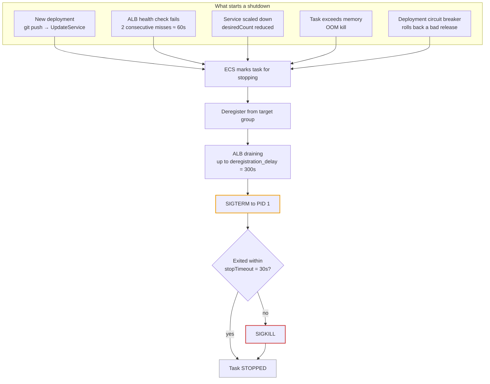
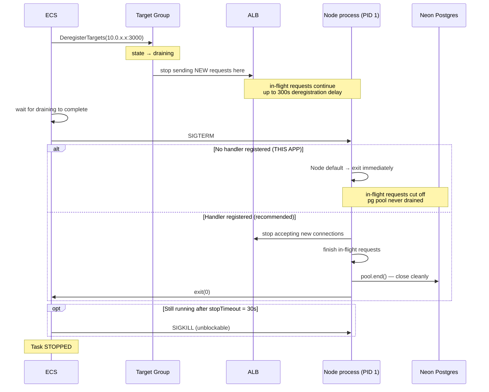
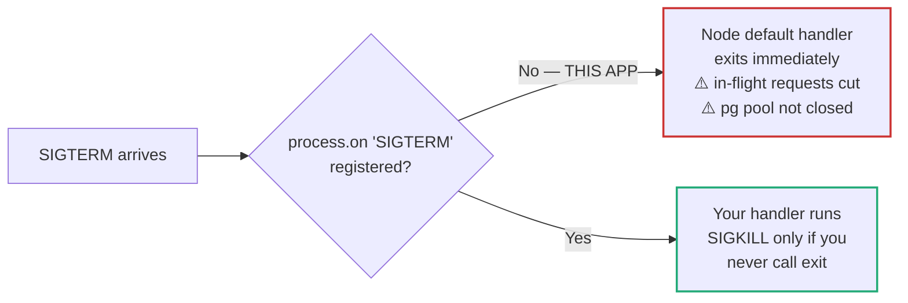
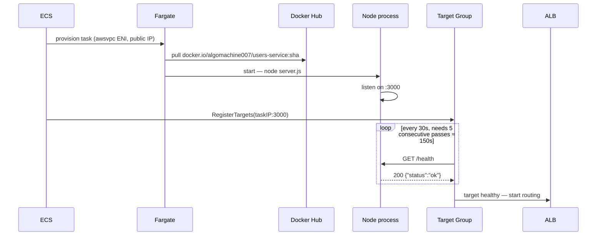
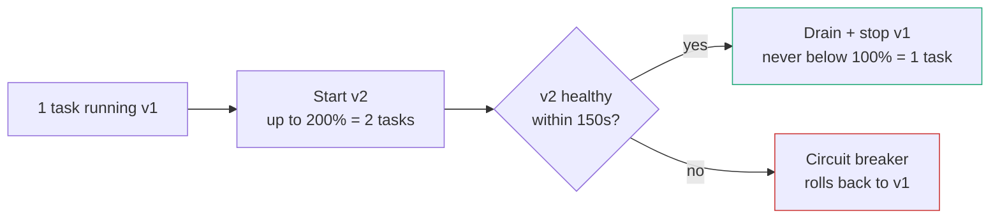

# ECS Task Lifecycle — how this app starts and stops

What actually happens when ECS starts, replaces, or kills a task in **this**
project, using the real configured values from `users-service-task` /
`orders-service-task` and the `tg-users-prod` / `orders-tg-prod` target groups.

> **The headline finding:** neither service handles `SIGTERM`. There is no
> `process.on('SIGTERM', ...)` anywhere, and `app.listen()` isn't even assigned
> to a variable, so there's no server object to close. Every deploy therefore
> kills in-flight requests. See [What actually happens here](#what-actually-happens-here).

---

## The configured numbers

These drive every timing below. All are current values, not defaults I assumed:

| Setting | Where | Value | Effect |
|---|---|---|---|
| `stopTimeout` | task definition | *unset* → **30s** | SIGTERM → SIGKILL window |
| `deregistration_delay.timeout_seconds` | target group | **300s** (5 min) | How long the ALB drains a leaving task |
| Health check interval | target group | **30s** | How often `/health` is polled |
| Health check timeout | target group | **5s** | Per-check response deadline |
| Healthy threshold | target group | **5** | 5 passes × 30s ≈ **150s** to become healthy |
| Unhealthy threshold | target group | **2** | 2 fails × 30s ≈ **60s** to be declared unhealthy |
| `logConfiguration` | task definition | **null** | ⚠️ no logs are captured anywhere |
| Container `healthCheck` | task definition | **null** | only the ALB checks health |

---

## Why ECS stops a task



All five triggers converge on the same shutdown path. In this project, trigger
**T2** is the one that bit repeatedly during setup: the target group's health
check pointed at `/`, which these services don't serve, so every task was
declared unhealthy after ~60s and replaced — forever, in a loop.

---

## The shutdown sequence, in order



### Step by step

1. **ECS decides to stop the task** — from any trigger above.
2. **Deregistration comes first.** ECS removes the task's IP from the target
   group *before* touching the process, so the ALB stops routing new requests to
   it. This ordering is what makes zero-downtime deploys possible.
3. **The ALB drains.** The target sits in `draining` state while existing
   connections finish, up to the **300s** deregistration delay. You can observe
   this directly:
   ```bash
   aws elbv2 describe-target-health --region eu-north-1 \
     --target-group-arn arn:aws:elasticloadbalancing:eu-north-1:006291942168:targetgroup/tg-users-prod/124b7de31717b89e \
     --query 'TargetHealthDescriptions[].{id:Target.Id,state:TargetHealth.State,desc:TargetHealth.Description}'
   # → state: "draining", desc: "Target deregistration is in progress"
   ```
4. **SIGTERM to PID 1.** ECS asks the container's main process to shut down.
5. **The 30s window.** If the process hasn't exited within `stopTimeout`, ECS
   sends **SIGKILL**, which cannot be caught, blocked, or ignored.

---

## What actually happens here

A common mental model says: *"if your app ignores SIGTERM, it gets SIGKILLed
after the grace period."* **That is not what happens in this app**, and the
distinction matters.

Node.js installs **default handlers** for `SIGTERM` and `SIGINT`. With no
listener registered, the default disposition is to **terminate the process
immediately**. So these services don't linger for 30 seconds and get force-killed
— they die instantly, the moment SIGTERM lands.



So the risk here isn't a hung container waiting for SIGKILL. It's the opposite —
an **abrupt** exit:

| Consequence | Why |
|---|---|
| In-flight requests cut mid-response | The HTTP server is never told to stop gracefully |
| Postgres connections dropped abruptly | `pool.end()` is never called; Neon reclaims them on its own timeout |
| No shutdown record | `logConfiguration` is null, so nothing is logged anywhere |

Because the ALB deregisters *before* sending SIGTERM, most deploys still look
clean — new requests were already being routed elsewhere. The damage is limited
to requests that were **already executing** when SIGTERM landed. Under low
traffic that's often zero, which is exactly why this class of bug hides in
staging and shows up under production load.

### The fix

Add to both `users-service/server.js` and `orders-service/server.js`:

```js
const server = app.listen(port, () => {
  console.log(`users-service listening on port ${port}`);
});

process.on('SIGTERM', () => {
  server.close(async () => {
    await pool.end();
    process.exit(0);
  });

  // Safety net: force exit before ECS SIGKILLs us at 30s
  setTimeout(() => process.exit(1), 25_000).unref();
});
```

Three things make this correct:

1. **`app.listen()` is captured** — you need the server object to call `.close()`.
2. **`server.close()` stops accepting new connections** but lets in-flight
   requests finish before the callback runs.
3. **The 25s timer fires before ECS's 30s `stopTimeout`**, so you exit on your
   own terms rather than being SIGKILLed. `.unref()` stops the timer itself from
   holding the process open.

---

## Startup, for contrast



Note the asymmetry: **~150s to become healthy** (5 passes × 30s) but only **~60s
to be declared unhealthy** (2 failures × 30s). Deliberate — quick to evict a bad
task, slow to trust a new one. It's also why a new deployment takes a couple of
minutes to serve traffic even though the container started in seconds.

`/health` in these services runs `SELECT 1` against Postgres, so a healthy target
proves both the process *and* its database connection are alive:

```js
app.get('/health', async (req, res) => {
  try {
    await pool.query('SELECT 1');
    res.json({ status: 'ok' });
  } catch (err) {
    res.status(503).json({ status: 'error', error: 'database unreachable' });
  }
});
```

That's a deliberate trade-off: if Neon has a blip, tasks get marked unhealthy and
replaced — replacement won't help if the database is the problem. A shallower
check (process-alive only) avoids that but hides real breakage. This project
chose the deeper check.

---

## Rolling deployments

`minimumHealthyPercent=100`, `maximumPercent=200`, with the **deployment circuit
breaker enabled and rollback on**. With `desiredCount=1` that means:



Old tasks are only stopped **after** new ones pass health checks, so there's no
window with zero healthy tasks. The circuit breaker is what produced
`rolloutState: FAILED` with *"Rollback failed"* during setup — v2 could never
pass health checks (wrong health path, then a bad image reference), so it kept
retrying and rolling back.

---

## Observing it

There is **no logging configured** on either task definition
(`logConfiguration: null`), so container output is discarded — you cannot see
what a container printed as it died. To fix, add to each container definition:

```json
"logConfiguration": {
  "logDriver": "awslogs",
  "options": {
    "awslogs-group": "/ecs/users-service",
    "awslogs-region": "eu-north-1",
    "awslogs-stream-prefix": "ecs",
    "awslogs-create-group": "true"
  }
}
```

The task execution role also needs `logs:CreateLogStream` and `logs:PutLogEvents`
(the AWS-managed `AmazonECSTaskExecutionRolePolicy` includes both).

Until then, **ECS service events are the only window** into task lifecycle:

```bash
aws ecs describe-services --cluster my-ecs-cluster-prod \
  --services users-service-task-service --region eu-north-1 \
  --query 'services[0].events[0:10].[createdAt,message]' --output text
```

These messages narrate the whole sequence:

```
(task ...) (port 3000) is unhealthy in (target-group ...) due to
  (reason Health checks failed with these codes: [404]).
(service ...) has stopped 1 running tasks: (task ...).
(service ...) deregistered 1 targets in (target-group ...)
(service ..., taskSet ...) has begun draining connections on 1 tasks.
```

Read bottom-up, that's the shutdown sequence in this document, as it actually
happened in this cluster.

---

## Summary

| Phase | Duration here | Controlled by |
|---|---|---|
| Image pull + process start | seconds | container size |
| Becoming healthy | ~150s | 5 × 30s health check interval |
| Declared unhealthy | ~60s | 2 × 30s health check interval |
| Draining on shutdown | up to 300s | `deregistration_delay.timeout_seconds` |
| SIGTERM → SIGKILL | 30s | `stopTimeout` (unset → default) |
| **Actual shutdown in this app** | **immediate** | no SIGTERM handler → Node default exit |

**Recommended changes, highest value first:**

1. Add SIGTERM handlers to both services (drops requests on every deploy today).
2. Add `logConfiguration` to both task definitions (currently flying blind).
3. Consider lowering `deregistration_delay` from 300s to ~30s — these are short
   JSON APIs, not long downloads, and 5 minutes makes deploys needlessly slow.
